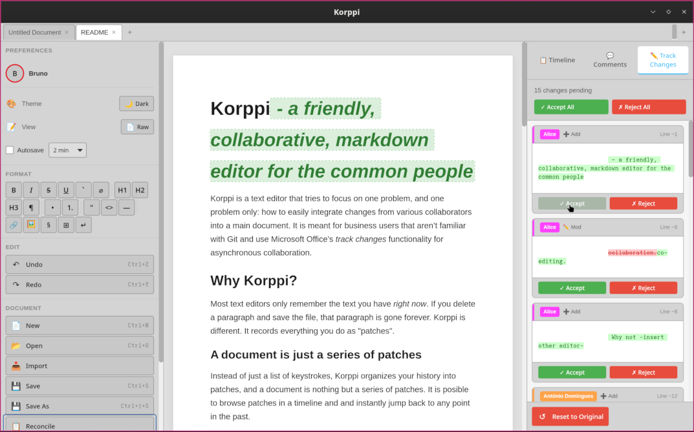

# ★ Welcome to Korppi! ★

<h2>✨ The Markdown Editor That Remembers ✨</h2>

Track every change. Review and reconcile. Asynchronous collaboration made easy!

★★★ NOW AVAILABLE FOR LINUX, MACOS, AND WINDOWS! ★★★ DOWNLOAD TODAY! ★★★

---

<iframe width="560" height="315" src="https://www.youtube.com/embed/nDaliT9W_zU?si=TsYiG5PRI46xPNgH" title="YouTube video player" frameborder="0" allow="accelerometer; autoplay; clipboard-write; encrypted-media; gyroscope; picture-in-picture; web-share" referrerpolicy="strict-origin-when-cross-origin" allowfullscreen></iframe>

## What is Korppi?

**Korppi** (Finnish for *raven*) is a text editor that tries to focus on one
problem, and one problem only: how to easily integrate changes from various
collaborators into a main document. It is meant for business users that aren’t
familiar with Git and use Microsoft Office’s *track changes* functionality for
asynchronous collaboration. It is meant for users that can't use real-time,
online-only services like Google Docs for privacy reasons or that cannot get
access to such a tool.

Unlike traditional editors, Korppi remembers **every change you make** and lets
you travel through time to see how your document evolved!

The idea is to first use Korppi to **just focus on the content** and gather
feedback and input from coworkers. Then, use Korppi's user-friendly
reconciliation features to merge all the input in the same document, **export to
Word format** and continue with the layout there!

Korppi is open-source, runs on your machine without the need to create an account,
register a credit card, no ads, no telemetry no nothing. It's just a simple
text editor, but with nice built-in features to easily reconcile documents!

- **Timeline Tracking** - See every edit as a visual timeline
- **Smart Reconciliation** - Import changes from other versions easily
- **Rich Formatting** - Full markdown with tables, code, images
- **Comments & Reviews** - Collaborate with inline comments
- **Export Anywhere** - Markdown, Word DOCX, and more
- **Autosave** - Never lose your work again

---

## Quick Links

| Section | Description |
|---------|-------------|
| [Installation](installation.html) | Download and install Korppi |
| [Quick Start](quick-start.html) | Get writing in 5 minutes |
| [Features](formatting.html) | Explore what Korppi can do |
| [Keyboard Shortcuts](keyboard-shortcuts.html) | Master the shortcuts |
| [FAQ](faq.html) | Common questions answered |

---

## System Requirements

- **Operating System:** Windows, macOS, or Linux distributions (tested on Ubuntu 24.04+ and NixOS)

---

## What's New?

### Version 0.2.0 (December 2025)

- 🎉 Initial public release
- ✏️ Full markdown editing
- 📊 Timeline with patch history
- 💬 Comments and review system
- 🔍 Find & Replace with regex support
- 📤 Export to Markdown and DOCX

---

🚧 UNDER CONSTRUCTION 🚧 
More features coming soon!

---

*Korppi is free and open source software. [View on GitHub →](https://github.com/b-rodrigues/korppi)*
